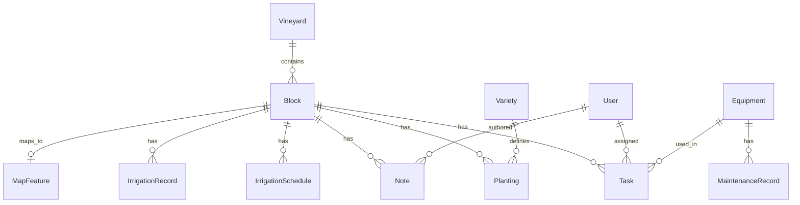

# Domain Model

## Entity relationship overview

## Core entities

### Vineyard

Top-level property. Cooper Estate starts with one vineyard record.

| Field | Type | Notes |
|-------|------|-------|
| name | string | e.g. "Cooper Estate Vineyards" |
| location | string | e.g. "Red Mountain, WA" |

### Block

Central operational anchor.

| Field | Type | Notes |
|-------|------|-------|
| code | string | Short ID, e.g. "CEV-01" |
| name | string | Display name |
| acreage | float? | Optional |
| status | enum | ACTIVE, FALLOW, REPLANTING |
| notes | text? | General block notes |

### Variety

Lookup table for grape varietals.

| Field | Type | Notes |
|-------|------|-------|
| name | string | e.g. "Cabernet Sauvignon" |
| color | enum? | RED, WHITE, ROSÉ |

### Planting

Links a block to a varietal with planting details.

| Field | Type | Notes |
|-------|------|-------|
| vineCount | int | Number of vines |
| yearPlanted | int | Planting year |
| rootstock | string? | Optional |
| rowSpacing | float? | Feet or meters (document unit) |
| vineSpacing | float? | Feet or meters |

### Task

Vineyard work item tied to a block.

| Field | Type | Notes |
|-------|------|-------|
| type | enum | PRUNING, SPRAYING, HARVESTING, INSPECTION, OTHER |
| status | enum | PENDING, IN_PROGRESS, COMPLETED, CANCELLED |
| title | string | Short description |
| dueDate | datetime? | |
| completedAt | datetime? | |
| assignedToId | string? | User |
| equipmentId | string? | Equipment |

### Equipment

Operational assets.

| Field | Type | Notes |
|-------|------|-------|
| name | string | |
| type | string | e.g. "Tractor", "Sprayer" |
| status | enum | ACTIVE, IN_MAINTENANCE, RETIRED |
| serialNumber | string? | |
| lastServicedAt | datetime? | |
| nextServiceAt | datetime? | |

### IrrigationSchedule

Recurring or planned irrigation for a block.

| Field | Type | Notes |
|-------|------|-------|
| frequency | string | e.g. "weekly", cron-like later |
| startDate | datetime | |
| volume | float? | Gallons or acre-feet (document unit) |
| method | string? | Drip, overhead, etc. |
| active | boolean | |

### IrrigationRecord

Actual irrigation event.

| Field | Type | Notes |
|-------|------|-------|
| scheduledAt | datetime? | Planned time |
| appliedAt | datetime | Actual application time |
| volume | float? | |
| duration | int? | Minutes |
| method | string? | |
| status | enum | SCHEDULED, APPLIED, MISSED, SKIPPED |

### Note

Free-text notes on a block.

| Field | Type | Notes |
|-------|------|-------|
| content | text | |
| authorId | string | User |
| blockId | string? | |

### MapFeature

GeoJSON geometry for map rendering.

| Field | Type | Notes |
|-------|------|-------|
| geometry | JSON | GeoJSON Polygon |
| centerLat | float | Centroid latitude |
| centerLng | float | Centroid longitude |
| blockId | string | 1:1 with Block |

### User

Auth.js user with role for future RBAC.

| Field | Type | Notes |
|-------|------|-------|
| email | string | Unique login |
| name | string? | |
| role | enum | OWNER, MANAGER, FIELD_WORKER, READ_ONLY |
| passwordHash | string? | Credentials provider only |

## Enums summary

- `BlockStatus`: ACTIVE, FALLOW, REPLANTING
- `VarietyColor`: RED, WHITE, ROSE
- `TaskType`: PRUNING, SPRAYING, HARVESTING, INSPECTION, OTHER
- `TaskStatus`: PENDING, IN_PROGRESS, COMPLETED, CANCELLED
- `EquipmentStatus`: ACTIVE, IN_MAINTENANCE, RETIRED
- `IrrigationStatus`: SCHEDULED, APPLIED, MISSED, SKIPPED
- `UserRole`: OWNER, MANAGER, FIELD_WORKER, READ_ONLY
